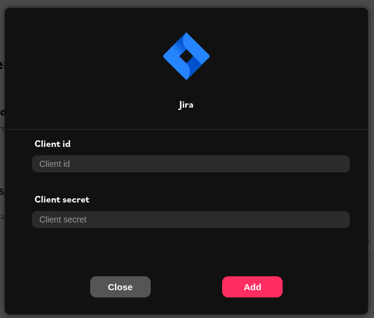

# Configure

## First, create an account

You have to create your workspace and owner at [register page](https://app.munityapss.com/register)

## Then, choose and configure your first connector

Connectors need information to works correctly. There are three different ways to configure connectors.

### Authenticate by Oauth2

You have to generate a new application on remote service to connect your users through Oauth2.

Then your connector need your application `client_id` and `client_secret`.

### Authenticate by API Key

You have to generate an API Key on remote service and copy paste it on your connector.

### Authenticate by User credentials

Some remote service need your user/password to provide there data.

## Finally, get your API Key and certificate

### For your backend : **API Key**

To fetch your customer data and interact with unified API from your **backend** your need an API Key.

API Key are linked to your user and workspace. If your user has admin privilege it can read and write data. Users with user privilege can only read data.

To generate an API Key go to [your user admin page](https://app.munityapps.com/admin).

This api key will be used as following on your request on munity unified API :

    Authorization: X-Api-Key <YOUR-API-KEY>

Exemple with CURL :

    curl -X GET 'https://api.munityapps.com/v1/customers/f87cc67d-b594-4407-a90d-b26cfdae8f14/pm-projects/' -H 'Authorization: X-Api-Key REM0aW39.NfO0123456789CNeHpF29wo'

### For your frontend : **Certificate**

Certificate is used to communicate from your frontend to Unified API. Indeed frontends are not secured so we have to encrypt exchanges.

The only time to communicate with our API from your frontend is when you ask for user credentials.

Our frontend librarie will make it easier, you only have to provide your `connector type` and `secret`.

In next section we will check how to use frontend lib and use it.
