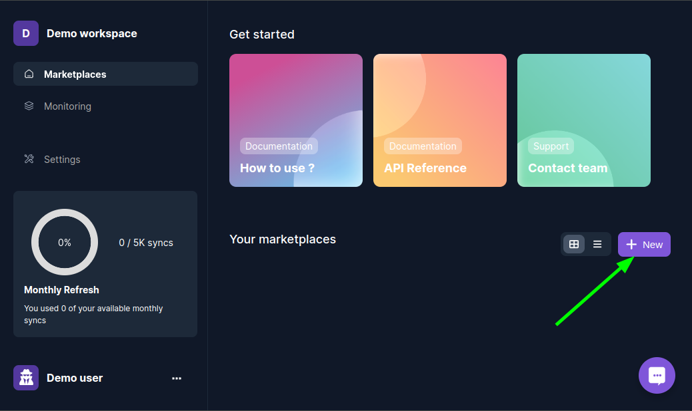
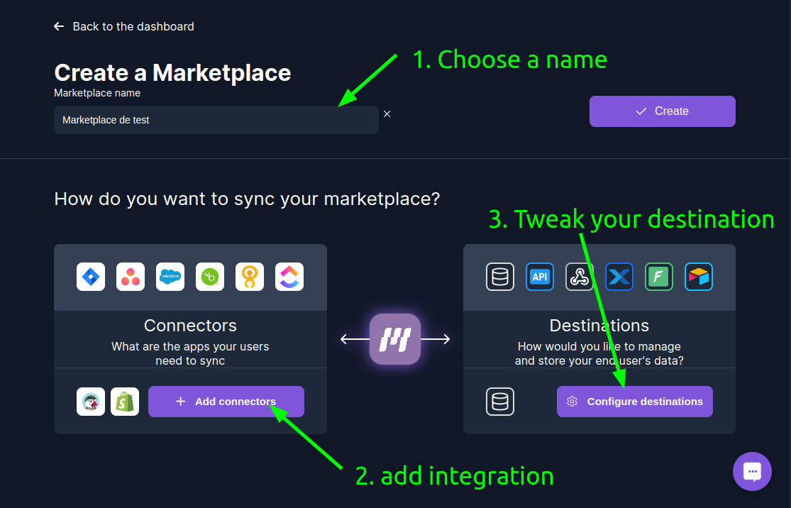
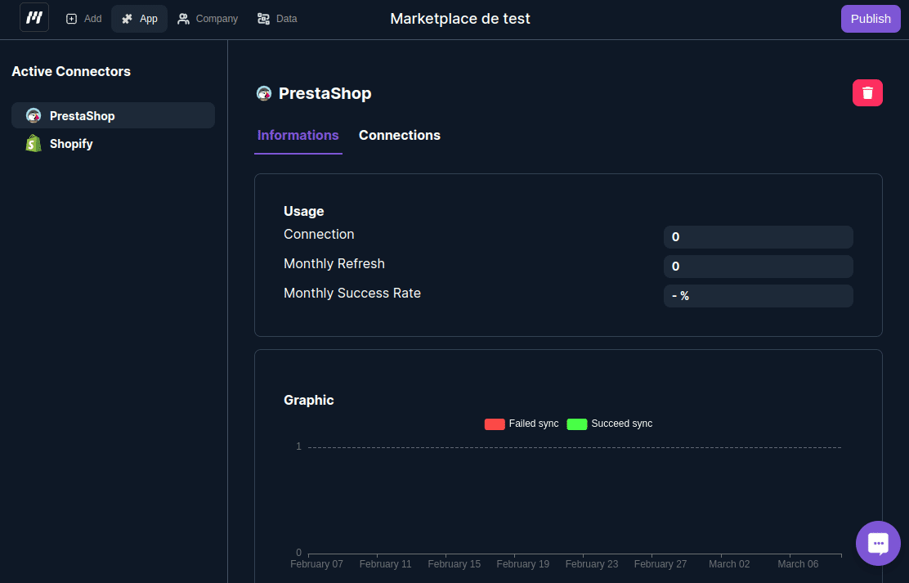
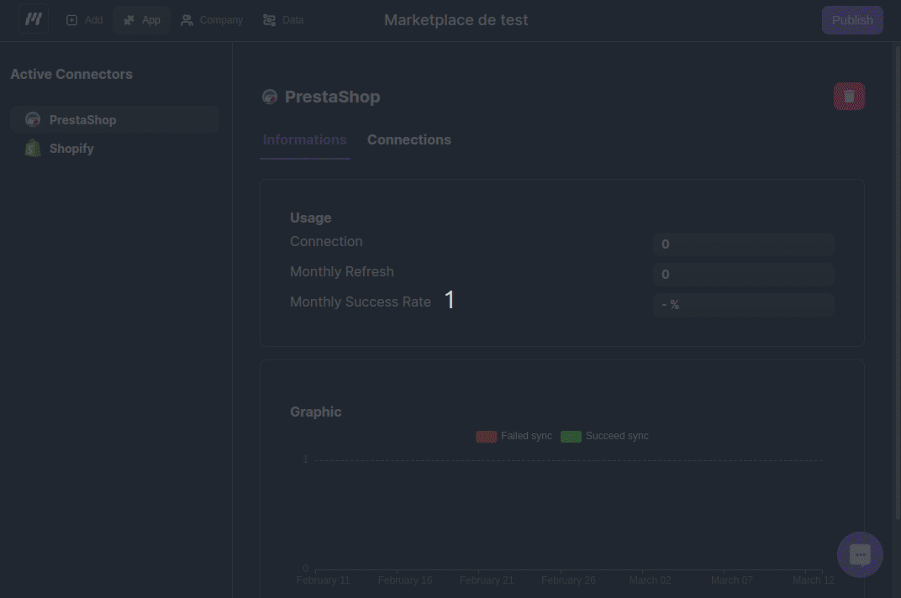
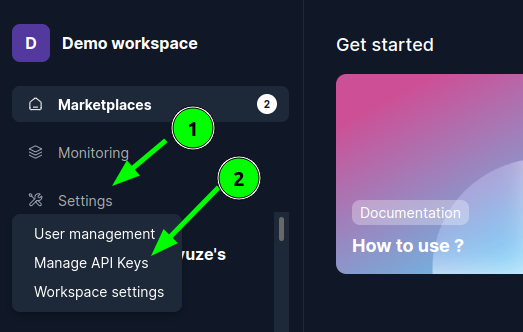
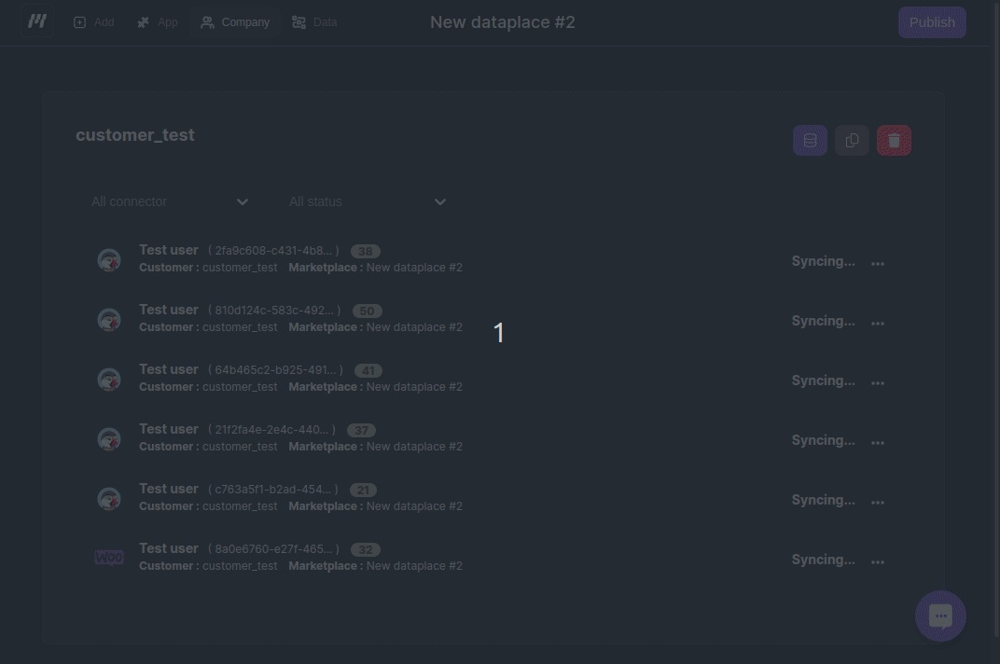

# Getting started

## Step 1: Create an Account

You need to create an account by logging into the platform.

## Step 2: Create marketplace

Marketplaces are where connectors reside. Create a marketplace for each project that requires access to your customer's company data.

### Step 2.1: Create your first marketplace

### Step 2.2: Choose connectors to create your marketplace

## Step 3: Create connections

A connection is a link between Munity and your customer's company data.

### Step 3.1: Create connection manually

### Step 3.2: Or Ask your users to create connections on their own

You need to add a "Connect" button on your saas to ask your customer's company data.

1. Navigate to the publish button.
2. Integrate the Munity library into your platform.
3. Inform us about the company_id associated with a customer, specify the connector, and then request a code snippet.
4. Copy and paste the provided snippet. You can customize the style according to your requirements.

### Step 4 : Access to your customer's company data.

You can access your customer's company data in four differents ways :

#### 1. Munity API

Use an API key and our API. You find our API reference [here](https://app.swaggerhub.com/apis-docs/CYRIL_8/munity-unified_api/). To generate an API Key go to your workspace settings.

#### 2. Connect to your customer's company database

Munity generates a dedicated database for each of your customers. You can connect to this database directly using any tool of your choice.

You can locate the credentials on the Company page.

#### 3. Webhook alerts

Munity can notify you when new data is received from your customer, when existing data is updated, or when data is deleted.

To enable this feature, you need to provide a 'Webhook URL' to your marketplace, and Munity will send you alerts accordingly.

Refer to the 'Webhook reference' section to learn how webhooks are structured.

#### 4. Integrate a no-code service like Xano

Lastly, you can integrate a no-code solution with your marketplace, allowing Munity to populate your customer's company data directly into it.