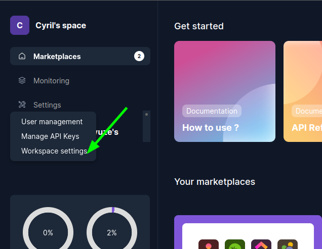

# How to use Backend : Interact with your customer data

To communicate with API you need an API Key that you can manage on munity unified API website.

You can find your api keys in [your user admin page](https://app.munityapps.com/admin).

This api key will be used on the Authorization header:

    Authorization: Api-Key <YOUR-API-KEY>

Exemple with CURL :

    curl -X GET 'https://api.munityapps.com/v1/customers/f87cc67d-b594-4407-a90d-b26cfdae8f14/pm-projects/' -H 'Authorization: Api-Key REM0aW39.NfO0123456789CNeHpF29wo'

You can access to our swagger to read all endpoint, how to implement it and what format are all responses :

[Munity Unified API Swagger](https://app.swaggerhub.com/apis-docs/dbyzero/munity-unified_api)

