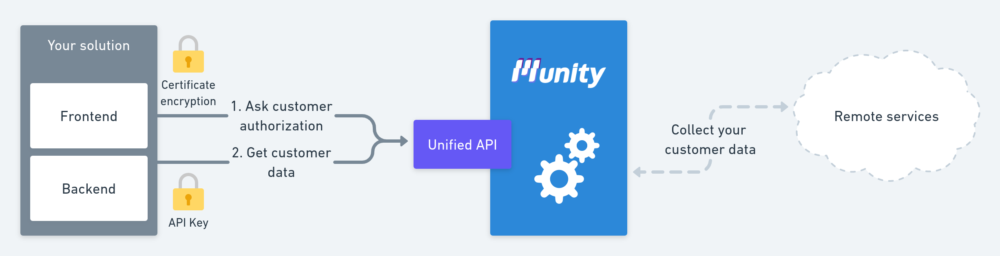
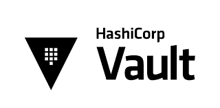
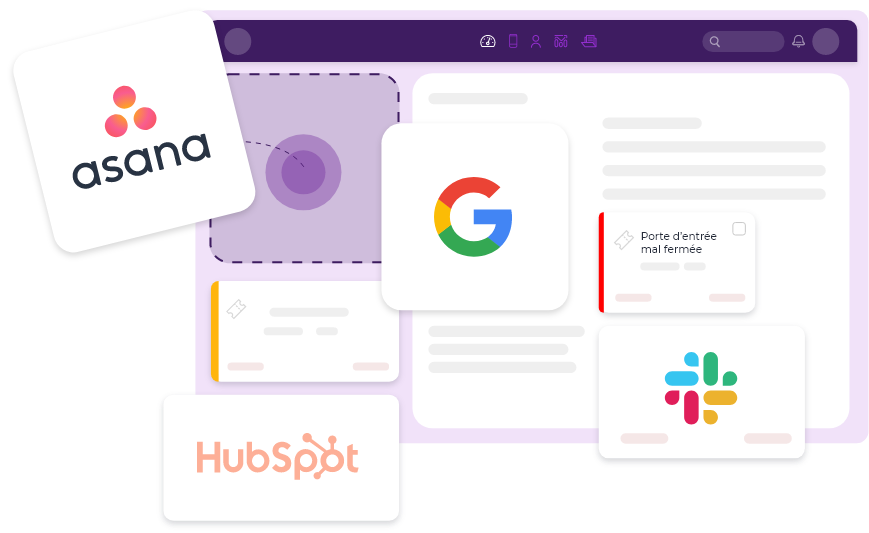

# Overview

Our goal with Munity is to **make third part integration easiest** as possible.

But we **don't want to trade simplicity to security**. So we are based on strong security standards to keep your customer data safe as Vault, DRF, Kubernetes, TLS and more.

To get many connectors out of the box we have **Airbyte** deep in our architecture, it is closed and **nobody can access it from outside**.

## Single interface

With your API Key you can fetch your customer data, manage your account, ask user authorization and activate new connectors.

## Credential management

Your customer credentials are stored in Vault and cannot be access without a strong accreditation. We manage this security for you and renew tokens when needed.

## Connector family

To reach simplicity we bring togethere similar API on a single model.

### Exemple :

* Project management : Jira, Wrike, Asana, Trello, Clickup....
* E-commerce : Shopify, Magento, Prestashop...

**Integrate once and get similar connectors in second.**

