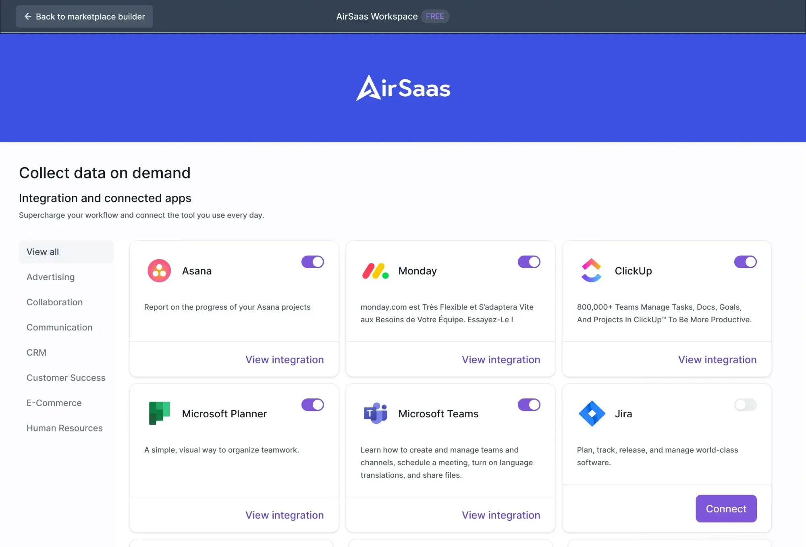

# Overview

Our mission at Munity is to **facilitate seamless third-party integrations**, prioritizing ease of use without sacrificing security. To this end, we adhere to stringent security standards, ensuring the protection of your customer data with technologies like Vault, Django Rest Framework (DRF), Kubernetes, Transport Layer Security (TLS), and more.

At the core of our architecture lies Airbyte open source ELT, enabling us to offer a wide array of connectors right out of the box. This component is securely encapsulated, preventing any external access and ensuring a high level of security.

## Single Interface for Comprehensive Management

Utilize your API key to effortlessly:

- Retrieve customer data
- Manage your account settings
- Request user authorizations
- Activate new connectors

This streamlined approach ensures you have all the tools necessary for efficient management in one place.

## Credential Management: Secure and Hassle-Free

We take the security of your customer credentials seriously. Stored securely in Vault, access is tightly controlled and requires strong authentication. Our system automatically handles the security, including token renewals, so you don't have to worry about it.

## Connector Family: Simplifying Integration Across Services

Our platform simplifies the integration process by grouping similar APIs into a single model, making it easier for you to connect with various services. This approach allows for a one-time integration with access to a wide range of similar connectors.

### Examples include:

- E-commerce/ERP (e.g., Prestashop, Shopify, WooCommerce...)
- CRM/VoIP (e.g., HubSpot, Salesforce, Zoho, Twilio...)
- Project management (e.g., Jira, Asana, Monday...)
- HRIS (e.g., Lucca, Factorial, Bamboo HR...)

### Integrate once, and gain access to a multitude of similar connectors instantly, streamlining your workflow and enhancing efficiency.

